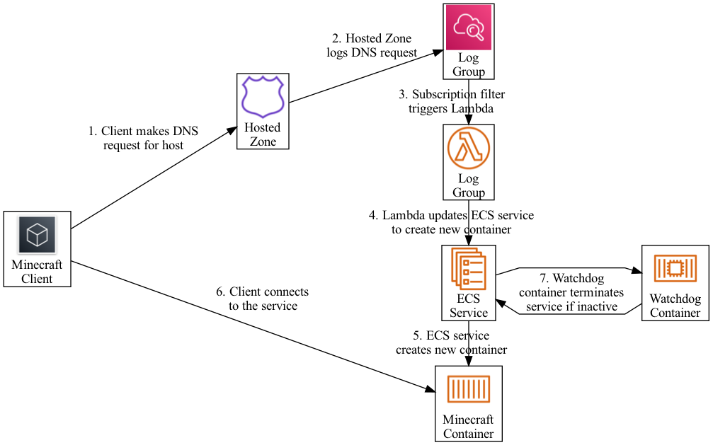

# Minecraft Ondemand

This is an on-demand Minecraft server hosted on AWS Fargate. It is largely inspired and driven by https://github.com/doctorray117/minecraft-ondemand. It has been built for my specific personal AWS Organization.

## Architecture



## Features

- Minecraft server hosting on AWS Fargate.
- On-demand trigger from a DNS log query.
- Watchdog sidecar container to terminate inactive tasks.
- CloudWatch dashboard to show resource utilization, world size, server logs, and trigger (DNS) requests.
- DataSync task to handle backing up and restoring world save data to and from AWS EFS and S3.
- Autoscaling group to handle spinning up an SSM Session Manager-compatible instance that you can connect EFS to for ad hoc file management
- Minecraft Overviewer world renders on a schedule, or on-demand

## Deployment

This is deployed to my personal organization so the IaC in this repo assumes you're deploying to an account that's been configured similar to my OrgFormation landing zone configurations (VPCs with SSM references, hosted zones with query logging configuration to CloudWatch logs, etc). These assumptions are usually apparent from [CloudFormation dynamic SSM parameter references](https://docs.aws.amazon.com/AWSCloudFormation/latest/UserGuide/dynamic-references.html).

Deployment is orchestrated through a Makefile. All deployment-related targets assume the following environment variables are exported:

```sh
export APPLICATION_NAME=minecraft
export ENVIRONMENT_NAME=dev
```

### Package

Before you deploy, you'll have to package your code first. This requires the following environment variables have been defined:

```sh
export ARTIFACT_BUCKET=ci-artifacts-123456789012-us-east-1
export ARTIFACT_PREFIX=minecraft
```

To package your code, run the following command:

```sh
$ make package
```

### Change Set Creation and Execution

Once you've packaged your code, you should have an `artifacts/template.packaged.yml` created. The Makefile handles deployments via CloudFormation changesets.

To create a change set, make sure the following environment variables are exported:

```sh
# ChangeSet details
export CHANGE_SET_NAME=update-$(date +%s)
export CHANGE_SET_DESCRIPTION=update-$(date +%s)
# CloudFormation parameters
export HOSTED_ZONE_NAME=my.domain.com
export DOMAIN_NAME=my.domain.com
export DNS_LOG_GROUP_NAME=/aws/route53/my.domain.com
export VPC_NAME=myvpc # My accounts receive a VPC with SSM parameter references to subnet IDs, who's name includes a common value: "VPC_NAME"
export MEMORY=8192
export CPU=1024
export MINECRAFT_SEED=123123
```

Then to create the change set run the following command:

```sh
$ make create-change-set
```

Then to execute the change set run the following command:

```sh
$ make deploy-change-set
```

## Management

### Data Management

A bastion template is included to serve as a bastion to access the EFS volume. It's configured as an autoscaling group with minimum capacity of 0 and maximum capacity of 1. If you want to use the bastion, start it up through setting the desired capacity to 1 and set it back to 0 when you're done.

The launched instances will be configured with everything required to use AWS SSM Session Manager. Additionally, you can use SSM with SSH to create an SSH tunnel to connect to the EFS volume on your local machine. The following explains how you can do that.

1. First configure your SSH config with the following section. This section will upload your ssh key to the bastion before it attempts to use SSM to connect to the host.
   ```ini
   host qqi-*
     ProxyCommand sh -c 'host=%h; host=${host/*qq/}; aws ec2-instance-connect send-ssh-public-key --instance-id $host --availability-zone $(aws ec2 describe-instances --instance-id $host --output text --query Reservations[].Instances[].Placement.AvailabilityZone) --instance-os-user ec2-user --ssh-public-key file://<YOUR_PUBLIC_SSH_KEY_FILE_HERE> && aws ssm start-session --target $host --document-name AWS-StartSSHSession --parameters "portNumber=%p"'
   ```
1. Then create an SSH tunnel with the bastion:
   ```sh
   $ ssh ec2-user@qq<BASTION_INSTANCE_ID> -L 2049:<EFS_FILESYSTEM_ID>.efs.<REGION>.amazonaws.com:2049
   ```
1. Mount your volume locally:
   ```sh
   $ sudo mount -t nfs -o nfsvers=4.0,rsize=1048576,wsize=1048576,hard,timeo=600,retrans=2,noresvport localhost:/ <TARGET_MOUNT_PATH>
   ```
